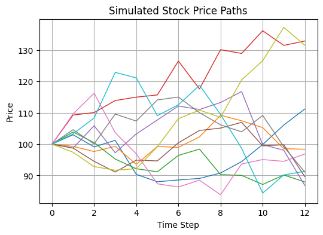
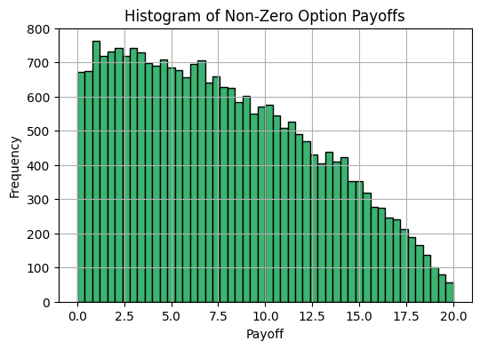

# Monte Carlo Simulation for Option Pricing
Monte-Carlo Single and Multi Asset Valuation This repository contains two Python-based Jupyter notebooks that demonstrate the use of Monte Carlo simulation techniques for pricing European-style options under stochastic processes.

## Contents
* `Monte-Carlo-SingleAsset.ipynb`
    
    Simulates the value of a European call option on a single asset using geometric Brownian motion. Includes:
    * Option valuation
    * Delta, Vega, and Rho sensitivity analysis
    * Average price (Asian) option extension
    * Knockout barrier option model

* `Monte-Carlo-MultiAsset.ipynb`

    Models a correlated two-asset system to price both individual and basket options. Includes:
    * Correlated normal generation
    * Basket payoff structures
    * Impact of correlation (ρ) on option pricing

## Sample Visuals



<em>Simulated stock price paths using geometric Brownian motion.</em>



<em>Histogram of non-zero payoffs for a knock-out option.</em>

## Concepts Applied
* Monte Carlo Simulation
* Geometric Brownian Motion
* Option Greeks (Delta, Vega, Rho)
* Basket Options & Correlation
* Risk-Neutral Valuation

## Dependencies
```
numpy
matplotlib
```

## Notes
* Simulations are seeded for reproducibility using `np.random.seed(42)`
* Notebooks are intended for educational purposes and illustrate theoretical pricing

## License
MIT License